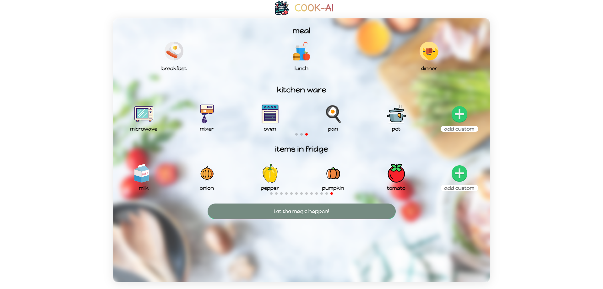
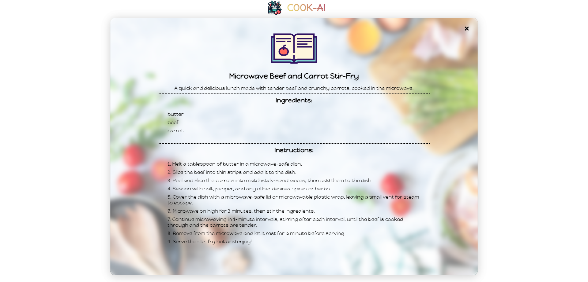
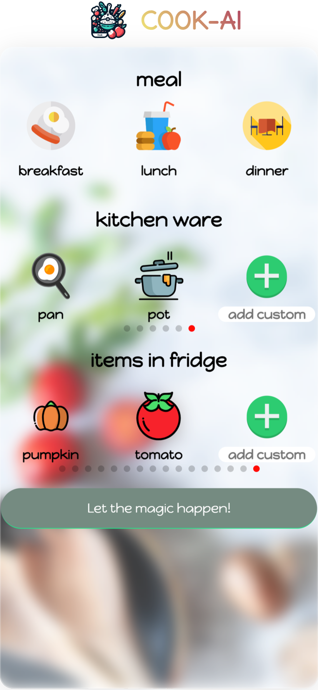
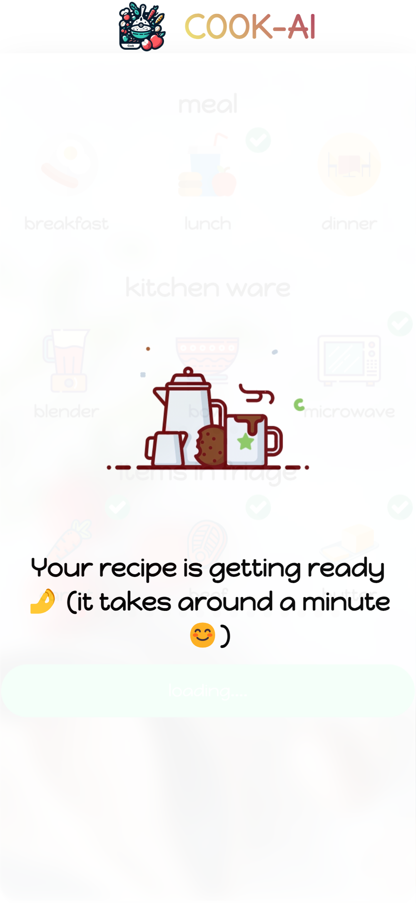
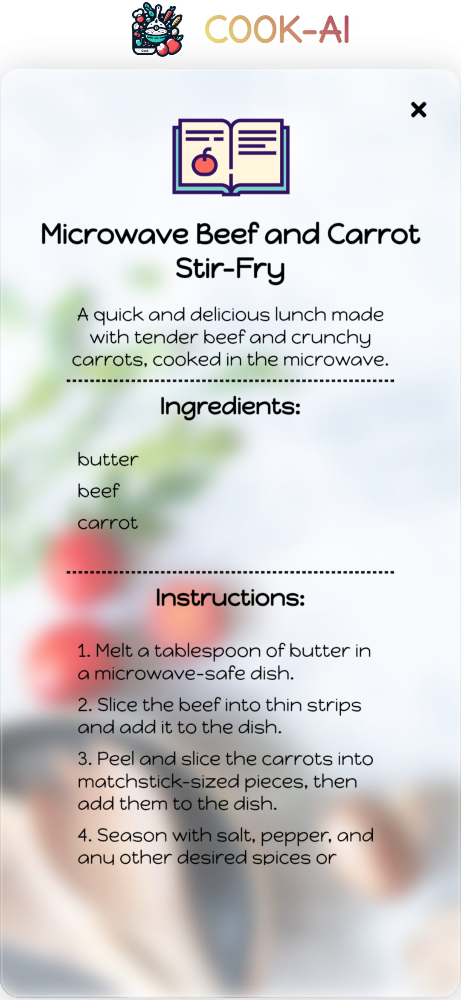

# Cook-AI

## Tool & technologies I've used

- React
- TypeScript
- Firebase functions
- SCSS + BEM
- ChatGPT API

## Getting Started

### Prerequisites

Before you start, you need to have [Node.js](https://nodejs.org/) and [npm](https://www.npmjs.com/) installed on your machine.

### Installation

1. Clone the repository to your local machine:

```sh
git clone https://github.com/justynalem/cookie-ai.git
```

2. Install the dependencies:

```sh
npm install
```

### Development

To start the development server, run:

```sh
npm run dev
firebase emulators:start --only functions
```

This will start the development server at `http://localhost:5173`.

### Production

To build the production version of the app, run:

```sh
npm run build
```

This will create a `dist` directory with the compiled assets.

### Screens

# 

# 

# 

# 

# 
